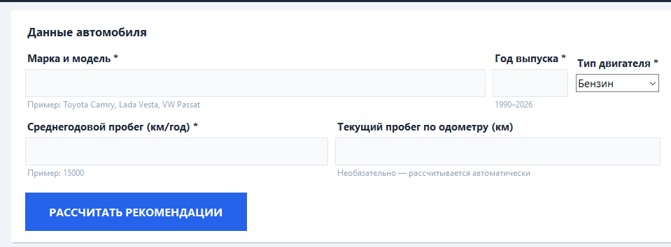
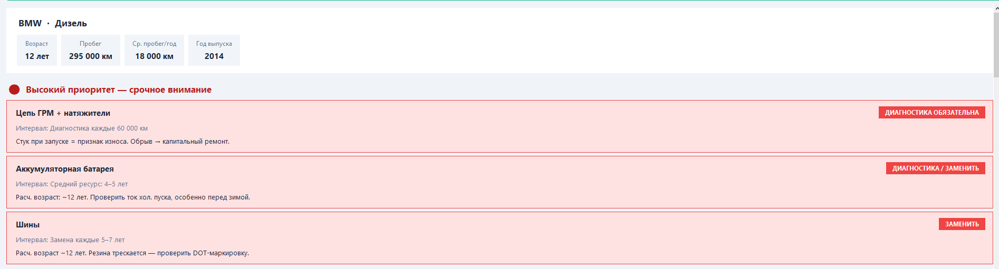
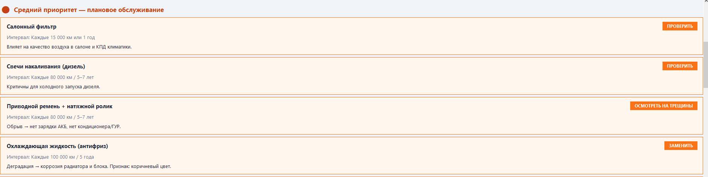
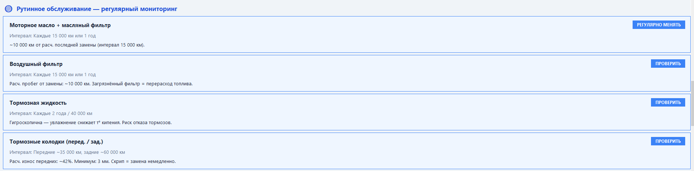
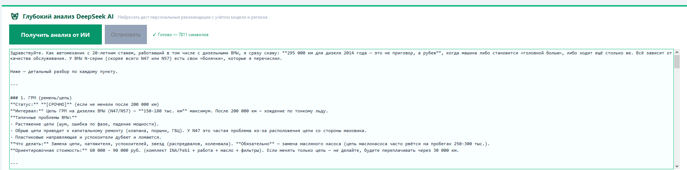

# AI Car Detail — ИИ-помощник по техобслуживанию автомобиля

** Десктопное приложение на Python с интеграцией DeepSeek AI **

Приложение анализирует данные автомобиля (год выпуска, общий и среднегодовой пробег, марку и тип двигателя) и с помощью нейросети **DeepSeek** выдаёт персонализированные рекомендации по техническому обслуживанию более чем 13 узлов и агрегатов.


## 📸 Скриншоты

### Главный экран приложения


### Анализ автомобиля (ввод данных)




### Результаты работы нейросети


## О проекте

**AI Car Detail** — это простой, но функциональный инструмент, который помогает автовладельцам и автосервисам принимать обоснованные решения по обслуживанию автомобиля на основе реальных данных эксплуатации.

Приложение демонстрирует:
- Работу с внешними AI API
- Обработку пользовательского ввода и генерацию контекстных рекомендаций
- Создание удобного десктопного интерфейса на чистом Python

## Основные возможности

- Ввод ключевых параметров автомобиля (марка, год, тип двигателя, общий пробег, среднегодовой пробег)
- Анализ износа и генерация рекомендаций по **13+ узлам** (тормозная система, двигатель, трансмиссия, подвеска, электрооборудование и др.)
- Использование **DeepSeek AI** лия глубокого и релевантного анализа
- Потоковый вывод ответов (streaming) — результат появляется попостепенно
- Локальное содержание API-ключа (без отправки на сервер)
- Кроссплатформенный интерфейс на Tkinter

## Как это работает

1. Пользователь вводит данные автомобиля в удобную форму.
2. Данные отправляются в **DeepSeek API** вместе с грамотно составленным промптом.
3. Нейросеть анализирует возраст, пробег и интенсивность эксплуатации.
4. Приложение получает и отображает структурированные рекомендации по обслуживанию и замене комплектующих.

## Технологии

- **Python 3.10+**
- **Tkinter** — встроенный GUI
- **DeepSeek API** — для генерации рекомендаций
- Локальное хранение конфигурации (`config.json`)

## Установка и запуск

```bash
git clone https://github.com/Bobidze/AI_Car_Detail.git
cd AI_Car_Detail

pip install -r requirements.txt

python car_maintenance.py
```

## Настройка DeepSeek API

1. Зарегистрируйся и получи API-ключ на [platform.deepseek.com](https://platform.deepseek.com)
2. В приложении вставь ключ в соответствующее поле
3. Нажми кнопку **«Сохранить ключ»**

Ключ сохраняется локально в файле `config.json` (этот файл добавлен в `.gitignore`).

## Планы развития

- Перенос интерфейса на **Flutter** (мобильная + веб-версия)
- Добавление истории запросов и содержания результатов
- Экспорт рекомендаций в PDF
- Поддержка нескольких языков
- Интеграция с базами данных автомобилей (VIN, модели)

## Лицензия

MIT License

---

**Developed by Nikita Tarasiuk**  
Junior Flutter Developer | AI Integration Enthusiast  
Shanghai, China
